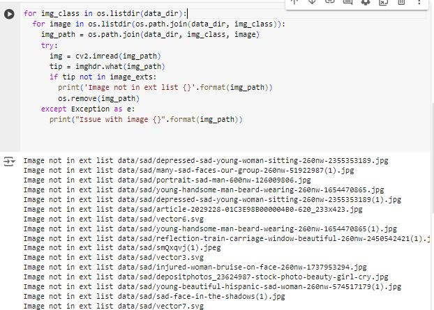
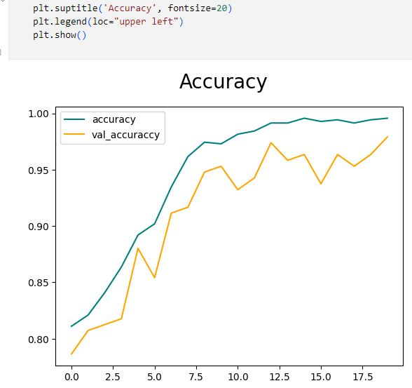

# Tensorflow Image Classification
- In this project, i explore how to gather images from the web for happy and sad faces recognition, preprocess the images, and train a model using the images.

## Gathering images
- I downloaded images from google by querying for `happy face images` and `sad face images` and used the `Download all images` extension to download all the results. I then removed vector files and other images that do not end in file extensions ['jpeg', 'jpg', 'png'] using `os.listdir` and `os.remove`.

## Dataset Generation
- After that i created the dataset generator using `tf.keras.utils.image_dataset_from_directory` and `as_numpy_iterator()` to get a single batch and take a look at the shape and plot the images.

## Model Architecture
- I then built a model using the `Sequential` API with 3 `Con2D` and `MaxPooling2D` blocks and a `Dense` layer before the final `sigmoid` activated `Dense` layer that will predict happy or sad.
- I used `BinaryCrossentropy` loss and `adam` optimizer.

## Model Training
- I trained the model for 10 epochs and the history shows 97% validation accuracy and 94% test accuracy.

 

