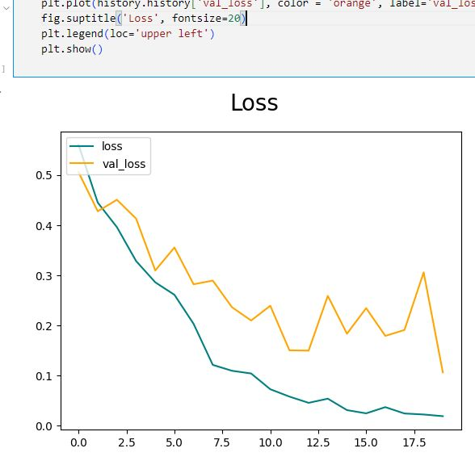
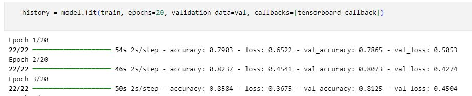

# TensorFlow Image Classification
- In this project, I explore how to gather images from the web for happy and sad face recognition, preprocess the images, and train a model using those images.
- You can get the code in [tensorflow_image_classification.ipynb](./tensorflow_image_classification.ipynb)

## Gathering Images
- I downloaded images from Google by querying for "happy face images" and "sad face images" using the `Download all images` extension to download all the results.
- I then removed vector files and other images that do not have file extensions like ['jpeg', 'jpg', 'png'] using `os.listdir` and `os.remove`.

- After identifying images to be removed, I used a simple script to clean the dataset and retain only valid image formats.

## Dataset Generation
- After cleaning the images, I created the dataset generator using `tf.keras.utils.image_dataset_from_directory` and called `as_numpy_iterator()` to extract a single batch, which allowed me to inspect the shape and structure of the data.
- Below is the dataset after loading the images.

- A look at a single batch of data to inspect the size and format of the images.

- I then plotted the images from the dataset to visually confirm the preprocessing steps.

## Model Architecture
- The model was constructed using the `Sequential` API. It consists of 3 convolutional (`Conv2D`) and pooling (`MaxPooling2D`) blocks, followed by a dense layer for classification. The final dense layer has a `softmax` activation to predict either "happy" or "sad."
- The model was compiled using `sparse_categorical_crossentropy` as the loss function and the `adam` optimizer.

## Model Training
- I trained the model for 10 epochs. Below are the accuracy and loss curves, indicating the progress during training.
- The model achieved a validation accuracy of 97% and a test accuracy of 94%.

- The training progress during the first three epochs is visualized below.

- Finally, this shows the progress of the last 3 epochs of the training process.

## Setup
- Create a virtual environment: `python -m venv venv`
- Activate the virtual environment: `call venv/Scripts/activate.bat` in cmd
- Install the dependencies: `pip install -r requirements.txt`

# Libraries
- TensorFlow
- Numpy
- Matplotlib
- OS

## Contact
- LinkedIn: [Natan Asrat](https://linkedin.com/in/natan-asrat)
- Gmail: nathanyilmaasrat@gmail.com
- Telegram: [Natan Asrat](https://t.me/fail_your_way_to_success)
- Youtube: [Natville](https://www.youtube.com/@natvilletutor)
